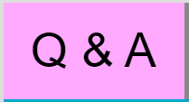

## 21.09.27

##### 속성작성요령

- 선택자 { 

  ​	존재유무/형태 ► display, overflow

  ​	위치 ► position

  ​	크기 ► width ⇒ height 

  ​	공간 ► margin ⇒ box-sizing ⇒ padding ⇒ border

  ​	서체 ► font-weight, font-style, font-size, line-height, family....

  ​	배경처리 ► background-image, repeat, posion, size, clip ....

  ​	기타효과 ► shadow, ....

  ​	애니메이션 

  }

---

- float 사용하면 속성은 block로 바뀜

- background-clip : 배경색상을 칠하는 범위
  - content-box : 내용만 칠해라
  - padding-box : padding의 범위까지 칠해라
  - border-box : 외곽선까지 칠해라
  - 구형브라우저에서는 안되는 경우 많음

- line-height : 픽셀 
  - 행간 / 한 줄의 간격을 해당 픽셀만큼 맞춰줌 ( text를 중간쯤에 넣어줌)
  - 한 줄일 경우에만 사용 할 수 있음
  - 워드나 한글에서 쓰는 첫줄은 움직이지 않는 행간은 영어로 'leading' - 웹에서는 없음
  -  line-height를 분홍색 박스의 height 만큼 넣어줌
  - vertical align : 세로정렬을 뜻하지만 <u>잘 사용은 안함</u>
  - vertical align 속성 :

aria : 더 공부하기