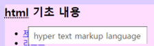

## 21.09.28

#### html

- abbr 태그 : 축약형을 뜻하는 태그

  ex) `<abbr title="hyper text markup language">html</abbr>`

  - 마우스 올리고 있으면 뜻이 나타남

    


#### semantic 태그 (의미가 있는 태그)

- semantic 태그를 사용하면 role은 삭제

- h태그 이용하여 이름 달아줘야 함 (footer는 자율)

- reset.css 에 `display: block;` 로 활용 (구형브라우저 / html5에 새로 생긴 태그)

- semantic 태그 종류

  ✔`<header> </header>` : 웹페이지의 상단에 주요 정보를 담고있는 부분

  ✔`<footer> </footer>` : 웹페이지의 하단에 주요 정보를 담고있는 부분 (기반이 되는 정보 / 회사의 정보)

  ✔`<article> </article>` : (기사, 최신 소식) 등

  ✔`<section> </section>` : 요약본, 광고, 임시목차

  ✔`<nav> </nav>` : 네비게이션

  ✔`<aside> </aside>` : 있어도 없어도 괜찮은 태그 / (최근본, 장바구니, 탑으로 이동)

  ✔`<main> </main>` : 본문에 들어가는 태그를 단순히 묶어주는 용도

  ✔`<figure> </figure>` : 조형물에 대한 설명 (보여주는것은 다 가능)

  ​	`<figcaption> </figcaption>` : figure 의 제목

  ```
  <figure>
  	<figcaption>이미지에 대한 설명</figcaption>
  	
  </figure>
  ```

- section 내부에는 작은 웹 구성이 가능 (header, article, footer 등 가능)

