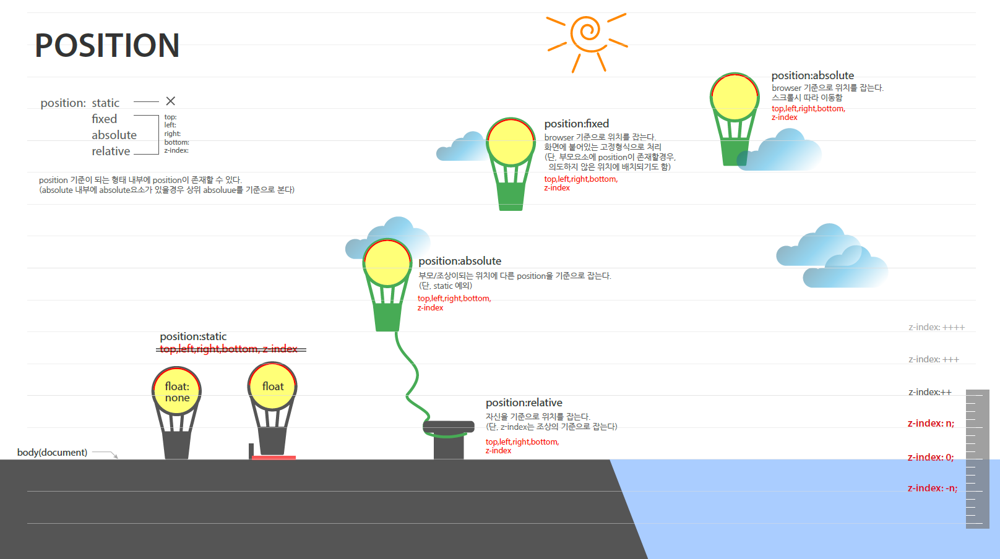

## 21.09.29

#### position

- position
  - static : 자신의 위치를 지킴
  - realtive : 자신의 위치를 지키고 위치 설정해주면 현재 자신의 자리로부터 배치됨, (자기자신을 기준으로 맞춤)
  - absolute : 자신의 위치를 잃어버리고 위치 설정해준 곳으로 고정됨, **스크롤 따라가지 않음**
  - fixed : 자신의 위치를 잃어버리고 위치 설정해준 곳으로 고정됨, **스크롤 따라감**
  
- 위치 설정
  - top
  - left
  - right
  - bottom
  - z-index : 단위x

- html은 나중에 쓴 코드가 위에 배치됨

  


#### css

css 불러오는 순서 : font/icon -> reset.css -> common.css -> design.css

```
body {

 --color-gray1 : #c4c4c4;

}
```

- css내부에 body안에  `color-gray1` 이라는 변수 선언

  - 사용 : `background-color: var(--color-gray1);` 

- 변수가 적용되지 않는 브라우저가 있음

  - ```
      background-color: #c4c4c4;
      background-color: var(--color-gray1);
    ```

    컬러를 사용해주고 밑에 변수를 사용


#### 기타

IR : image replace 알아보기

