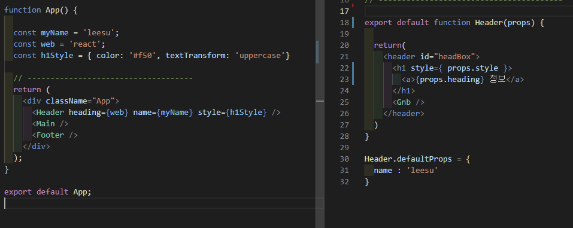

## 22.01.04

#### react

- `npm start`  : 리액트 시작

- `className` : 리액트에서는 class명을 `className`으로 써야함

- 리액트는 꼭 닫힌 코드가 있어야함

- 리액트는 불러올때 꼭 하나의 코드로 묶여있어야 한다.

  - 처음 생성되는 `.App`이 싫다면 `<></>` 이런 빈 코드로 사용해도 됨

- `{}` 로 묶으면 js코드 작성 가능

- return위에 변수 작성 후 해당 컴포넌트에 지정

  


##### 버튼 누를때 마다 하트 변경

```react
export default function ConBox(){
    
  let [fav, setFav] = useState('🤍');
  console.log(fav);

  const fnFavorite = () => {
    fav = (fav === '🤍') ? '🧡' : '🤍';
    setFav(fav)
  }

  return(
    <button type="button" onClick={fnFavorite}>좋아요</button>
    <span>{fav}</span>
  )
}

```


`useState()` : 하나의 내용에서 변경될 내용을 적용하기 위한 API

`useEffect()` : 상태체크(변화시 어떠한 기능을 확인 체크), fetching


##### npm 설치

- 아이콘 설치

  `npm i react-icons`


`npm run build` :  최종적으로 완성 후 내보낼때