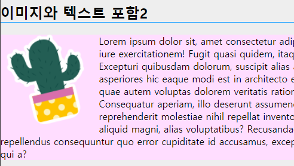
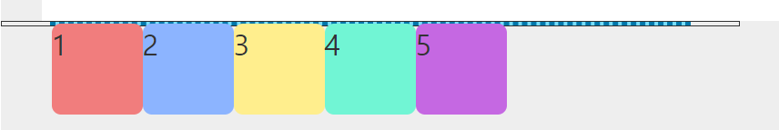
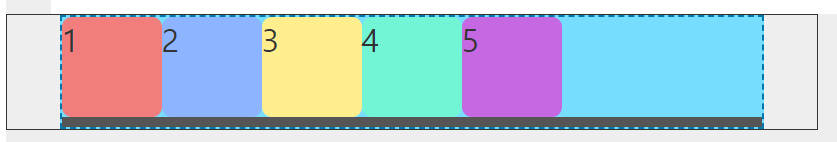

## 21.09.17

테이블 초기 셋팅

  ```css
        margin: 0; padding: 0;
        border-spacing: 0; border-collapse: collapse;
  ```


### css

#### 선택자

- `클래스명:hover` : 클래스에 마우스를 올렸을 경우

  - ```
    .none { 
      display: none;
      width: 100px; height: 300px; background-color: #afa;
    }
    .on:hover > div { display: block;}
    ```

  - 보통은 처음 나오지 않다가 위에 마우스 올리면 나오게 함

- `클래스명:active` : 클래스를 마우스로 눌렀을 경우

- `클래스명>a:visited` : 클래스에 있는 링크에 방문했을 경우 / background-color 안먹음

- `클래스명>a:link` : 클래스에 있는 링크인 경우

- `클래스명>a:focus` : 탭 눌렀을 때 탭이 선택한 곳과  클래스가 같을 경우

  - 조건 : a, button, input

- `클래스명:before` : 선택자의 내부 내용 이전에 추가

  - `content` 는 무조건 사용해야 함

  - ```css
    .front:before {
      content: "앞에 추가 - ";
      color: #f00; 
      display: inline-block;
      width: 100px; height: 10px;
      background-color: #fa0;
    }
    ```

- `클래스명:after` : 선택자의 내부 내용 이후에 추가

  - `content` 는 무조건 사용해야 함

  - ```css
    .back::after { content: " - 뒤에 추가"; }
    ```

- `::before` `::after` : 이중콜론 쓰는게 표준 / 과거에는 한번 쓰는게 표준

- `클래스명::first-letter` : 글씨 중에서 첫번째 글자에만 적용
- `클래스명::first-line` : 글씨 중에서 첫번째 줄에만 적용
  - fisrt 말고는 second, last 같은것 없음


#### float

- ex) img는 인라인/ p는 블럭 요소 이므로 밑 사진처럼 하기 위해서는  float 기능을 사용해야함



- 옆으로 나열
- display : block
- 부모 auto이면 사이즈 : 0

- 
  - 뒤에 파란색 점선이 부모

- (이미지 + text) X -> float 은 형제들 모두 float 사용해야 함
- 위 사진에서 판 역할을 하는 걸 형제 마지막에 넣어주고 `clear:both` 같은걸 넣어주면 부모의 높이가 생김
  - 
- 판떼기 역할은 꼭 div가 아니어도 됨 (hr, br, p 등등 가능)

- list 형태일 경우 li에 `::after`를 넣고 `content`는 공백 `display : none`

  - ```css
    ul.float_area::after {
      content: ""; display: block;
      width: 100%; height: 0;
      clear: both;
    }
    ```

- 대게는 클래스 명에 `clearfix`로 명명한 뒤 밑 코드처럼 암기해서 사용

  - ```css
    .clearfix::after {
      content: ""; display: block; clear: both;
    }
    ```

- 


#### css 파일 

- html 파일에서 link 로 선언 (연결)

  - ```html
    <link rel="stylesheet" href="../css/src/b_02_psuedo.css">
    ```

- css 파일 처음에 선언

  - ```css
    @charset "utf-8";
    ```

- html과 마찬가지로 첫줄에 주석 쓰면 오류

- 선택자 {} 

- @기능 () {}

  - `@media screen and (min-width:320px) {}`
  - `@supports (옵션) -> if문 기능`

-  @기능 {}

  - @animation 이름 {}

- @기능 "역할";

  - `@charset "utf-8";`
  - `@import url("data");`


#### 기타

- `ctrl + alt + 오른쪽 방향키` : 창 2개 켜기

- [**morderni.zr**](https://modernizr.com/) 
  - 구형브라우저의 호환성을 위해 사용하는 사이트 / .js이용

- `cc:ie` : explore를 위한 조건부 주석 단축키

- 모든 문서는 마지막 한줄 공간 남김
- 코딩용 폰트 : hack font / d2coding
- 이미지파일은 가로/세로 중 하나는 오토로 줘야 비율이 유지됨
- 페이지의 70%은 리스트 40%이상은 float

