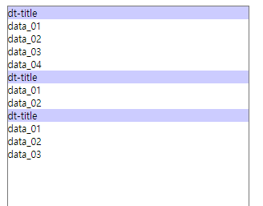
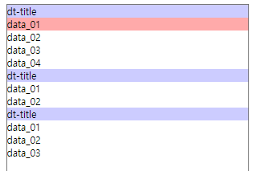
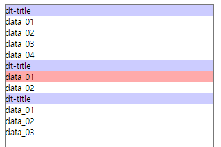
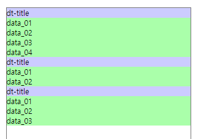
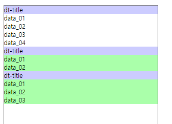

## 21.09.30

position 에서 기준을 잡아주는 속성은 relative

그 기준에 맞춰 포지션을 넣는것은 absolute


`+` : 형제선택자

position 안에 position 또 사용 가능 / relative 기준 잡아놓은것 잘 확인하기

- 인접형제선택자 + : 선택요소 바로 뒤에 오는 요소

- ```html
  <dl class="siblings">
      <dt>dt-title</dt>
      <dd>data_01</dd>
      <dd>data_02</dd>
      <dd>data_03</dd>
      <dd>data_04</dd>
  
      <dt>dt-title</dt>
      <dd>data_01</dd>
      <dd>data_02</dd>
  
      <dt>dt-title</dt>
      <dd>data_01</dd>
      <dd>data_02</dd>
      <dd>data_03</dd>
  
    </dl>
  ```

- ```css
  .siblings {
    width: 400px; height: 800px;
    margin: auto;
    border: 1px solid #777;
  }
  
  .siblings:hover dt {
    background-color: #ccf;
  }
  
  .siblings > dt:hover + dd {
    background-color: #faa;
  }
  ```

  - dl에 마우스 올리면 dt배경색 변경

    

  - dt에 마우스 올리면 바로 뒤에있는 dd에만 배경색 변경

    

    


- 형제선택자 ~ : 선택요소 뒤에 오는 조건에 맞는 요소

- ```css
  .siblings > dt:hover ~ dd{
    background-color: #afa;
  }
  ```

  - 마우스를 올린 dt기준으로 뒤에 dd만 배경색 변경

    

    

  

  

핵사코드로 투명도

- #aa00aa_ _ : 뒷자리에 16진수로 숫자 넣어서 투명도

`text-transform: capitalize;` : 첫 글자를 대문자로