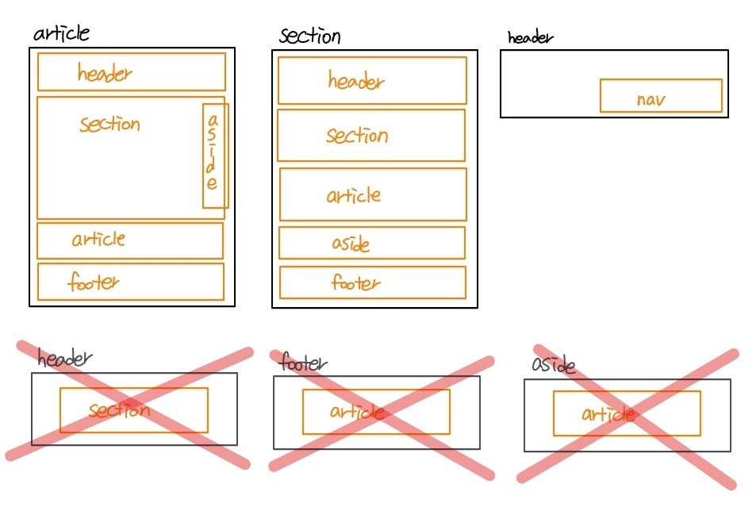

## 21.10.01

#### 시멘틱구조 특징

- 웹페이지의 본문의 성격을 띄는 article/section의 형식은 내부에 다시 header/article/section/nav/aside/footer ... 을 가질 수 있다.
  - section/article은 하나의 작은 웹이란 개념을 갖고있기 때문
- 하지만 header/asdie/footer/nav의 특정 위치나 기능을 자체의 성향을 가지고 있는 요소는 내부에 section/article을 사용할 수 없다.
- header의 경우는 내부에 nav요소를 가질 수 있다.




#### html

- dl 안에는 꼭 dt와 dd가 있어야함
  - 제목은 있고 내용이 없으면 오류남 (dt는 있고 dd는 없는 경우 - 주로 네비게이션)


#### css

- `list-style-type: decimal;` : 리스트 앞에 숫자 쓰기
  - 영역 밖으로 숫자가 튀어나와서 보임
  - padding-left 주면 들어옴
  - `list-style: decimal;` 도 가능
-  list-style 을 주지 않고 before으로도 가능

- ```css
  li::before {
    counter-increment: section;            /* 해당 인스턴스 안에서
                                              section 카운터 값 증가 */
    content: counters(section, ".") " ";   /* section 카운터 값을
                                              마침표(.)로 구분해 결합하여
                                              표시합니다. */
  }
  ```

- 학원에서 실습한 코드

  ```css
    .gallery_area {
      counter-reset: gal_li;
      background-color: #daf;
    }
  
    .gallery_area li::before {
      counter-increment: gal_li;
      content:counter(gal_li) ". ";
    }
  ```

  - 숫자는 increment로 해결 했지만 뒤에 . 은 " "안에 필요한 띄어쓰기 포함해서 넣어줌


- `display: flex;` : 옆으로 정렬 (최신기능이라 구형브라우저 구현 X)
- `justify-content: space-between;` : 플렉스와 같이 쓰면 가로로 사이간격 맞춰줌
- [flex 공부](https://heropy.blog/2018/11/24/css-flexible-box/)


- `:active` : 마우스 누르고 있는 경우(계속)


- headBox 를 상단에 고정 : `position: fixed`
  1. top: 0; 가로 가운데 배치 (전체 가로 꽉차게) : `left: 0; right: 0;`
  2. 다른 요소들 보다 앞에 배치 : `z-index: 100;` z-index로 위로 올려준다
  3. fixed를 처리함으로 인해 다른 요소(형제)들은 ? : 밑의 영역이 올라오기 때문에 상위영역에서 `padding-top`으로 잡아준다. / 반투명으로 보이게 하고싶을 경우는 따라 올라오게 냅둔 후 `rgba()`로 투명도를 조절해준다.
  4. 내부 요소는 가로 1200px 일때 가운데 배치? : 내부요소만 `div`로 묶어준 뒤 고정시켜주고 뒷 배경만 늘어나도록 한다.

