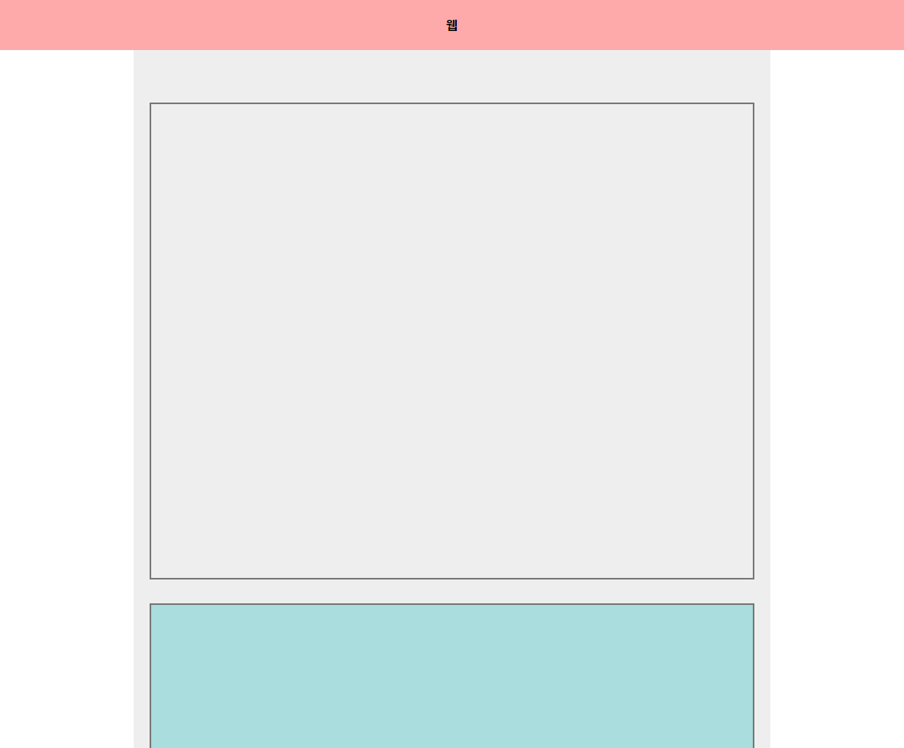
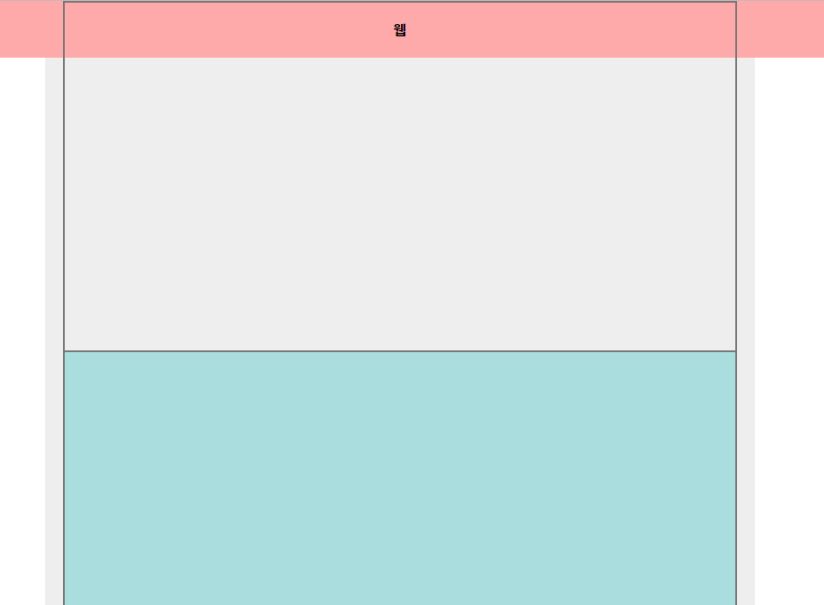
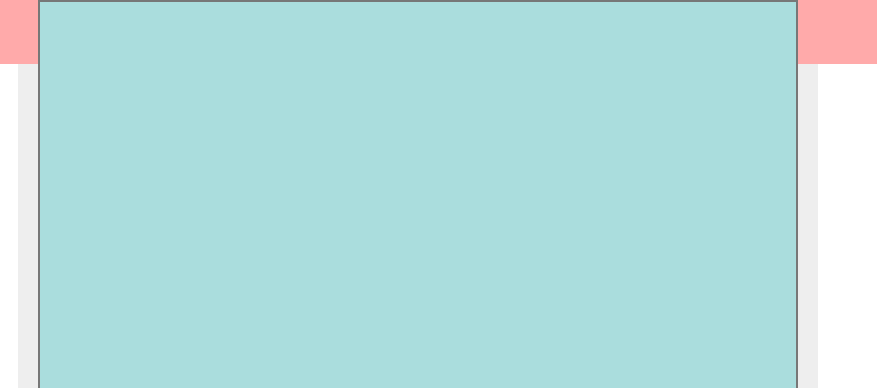
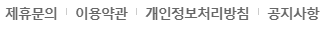
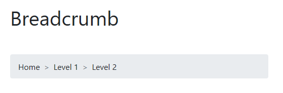

## 21.10.11

#### position

- `fixed` : fixed는 자신의 부모가 아닌 브라우저 기준

  - 위치를 지정해주지 않으면 브라우저의 왼쪽 상단이 아니라서 일단 부모쪽에 붙어있음

- `sticky` : `top: 0;`를 같이 사용하면 처음엔 제자리에 있다가 top 0 자리에 오면 fixed처럼 변함

  - 구형브라우저는 실행 안됨

  - 투명 상자와 민트색 상자 모두 같은 sticky 적용

     

    

    

    


- `relative` : 기준만 잡아주거나 z-index를 위해 사용
- `absolute` : relative가 기준이 됨
  - padding 적용 안됨
  - border는 적용 됨
  - 부모나 그 위에 부모에게도 relative가 없으면 브라우저 기준

---

##### 글씨 옆 바 만들기



```css
/* 가상요소: after 사용 */
.nav_list li:after,
.nav_list li::after {
  content: ""; display: block;
  position: absolute; top: 0; bottom: 0; right: -5px;
  margin: auto;
  width: 1px; height: 10px;
  border-right: 1px solid #777;
  display: none;
} 

.nav_list li:last-child:after,
.nav_list li:last-child::after { display: none;}
```

- background-color와 나머지는 본인 스타일대로 살리기

- b_step_01/html/c_01_position_set.html 참고


---

- `site breadcrumbs` 기법 : 사이트 이동경로

  

- `tabindex` 속성 : 

  - -1 : focus 기능을 가지고 있는 속성을 제거
  - 0 : focus 기능을 강제 부여 (a, button처럼)
  - 1 : focus 기능을 강제 부여 + 우선순위를 먼저 가질 수 있음

---

##### slide / indicator

- 인디케이터에서 해당 슬라이드로 이동 - href에 클래스 명

  ```html
  <li><a href="#slide_01"><span class="blind">01</span></a></li>
  ```

  

- 가운데 배치 - transform 사용

  ``` css
  .btn { 
    position: absolute; top: 50%; left: 50%;
    width: 130%; height: 0; 
    transform: translateX(-50%);
    margin: auto;
  }
  ```

- 그림자 안으로 넣기 - box-shadow에서 inset 사용

  ```css
  .btn button:focus { 
  	box-shadow: 3px 3px 3px #157 inset; background-color: #7aa;
  }
  ```

  

---

#### js

```js
//한줄 주석
```

```js
/*
여러줄
주석
*/
```

- 변수

```js
var t = 'test입니다.';
```

