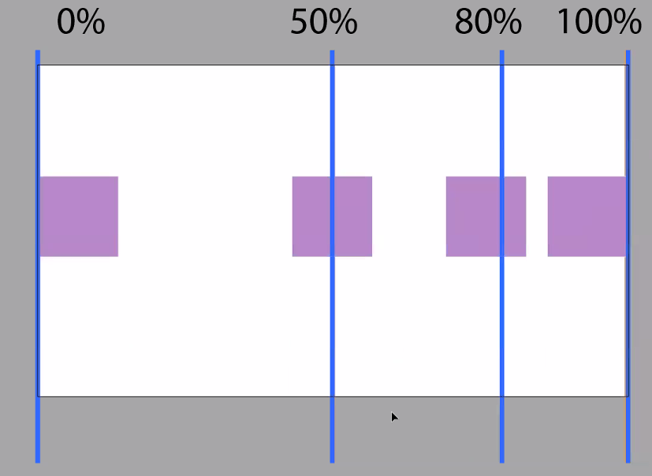
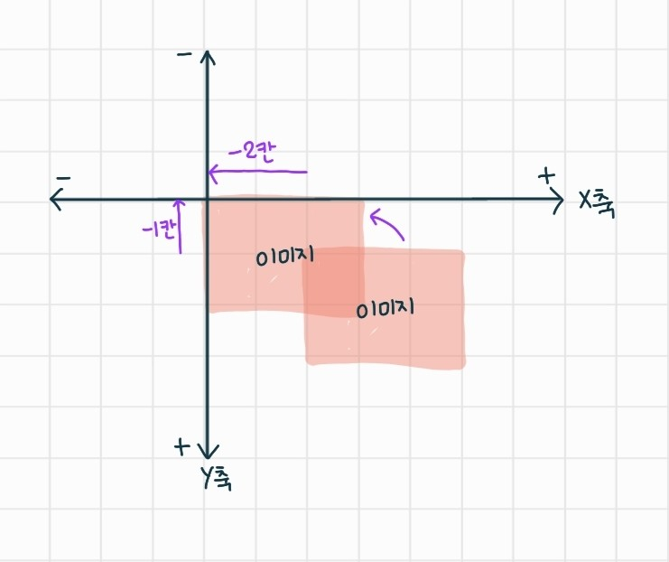

## 21.10.15

#### 이미지 삽입

- IR 기법 : image replace 글자를 대체하기 위해 이미지를 삽입하고 처리하는 기술

- IS 기법 : image sprite 여러개의 이미지를 삽입하여 한번에 관리하는 기술

#### 그림자 기법

- box-shadow : 요소에 그림자를 주는 기법
- text-shadow : 글자(텍스트)에 그림자를 주는 기법
- filter: drop-shadow() : 다양한 효과의 기능중에 filter효과로 처리하는 기법

#### transform

- translate() : 위치이동
- rotate() : 회전
- skew() : 기울기
- scale() : 배율(크기)
- perspective() : 원근법
  - perspective : 


----

##### background

- `background-repeat:`
  - `repeat;` : 기본
  - `no-repeat;` : 반복X
  - `repeat-x;` : 가로로 반복
  - `repeat-y;` : 세로로 반복

- `background-position:`

  - `0 0;` : 기본

  - `right top;` : 오른쪽 상단

  - `left center;` : 왼쪽  가운데 

  - **`x축 y축;` : 수치를 직접 입력해서 사용(%, px) (x y)** / right, center 이런걸로 사용 x

    - 퍼센트로 사용할 땐 이미지의 기준도 퍼센트에 맞게 변경

      

  - px 사용시 이미지와 배경 모두 왼쪽이 기준

  - `background-position: -110px -24px;` : 다중이미지를 사용할 때 보통 -를 사용한다

    - 웹에서는 오른쪽으로 가야 x축 +, 아래로 가야 y축 + 

    

- `background-size: `
  - `contain;` : 다보이게 채워줌
  - `cover;` : 가로나 세로 어디 한부분을 맞춰줌 (빈틈없이 꽉차게)
  - `100% auto;` : 가로를 꽉차게, 세로를 맞춰주기
  - `auto 100%;` : 가로는 맞춰주고 세로는 꽉차게
  - `none;` `initial;` : 원본 크기대로
- `background: url repeat position;` 한줄로 사용 가능 - 복잡함
- 한번에 여러개 이미지 처리 가능

```css
  background-image: url("../../img/icon/arrow.svg"), 
                    url("../../img/icon/chinchill.png"), 
                    url("../../img/icon/cow.png");
  background-repeat: no-repeat, repeat-x, repeat-y;
  background-position: 50% 0, 50% 50%, 100% 80%;
  background-size: 20px auto, 50px auto, auto 25px;
```

- `background-image: linear-gradient();` : 각도, colorA, colorB

  - `background-image: linear-gradient(45deg, #bbb 30%, #f50 40%, #fc0 );` 

    : 30%까지는 #bbb 컬러, 30~45%까지는 #f50 컬러, 45~이후는 #fc0 컬러

- `background-image: radial-gradient();` : 중앙에서부터 원형으로 그라데이션 - mdn에서 찾아보기

  - `background-image: radial-gradient(circle at 100%, #af0 10%, #a70);` : 오른쪽끝에서 원형으로 그라데이션

- `background-attachment:`
  - `fixed;` : 스크롤을 하면 뒷배경이 위치에 멈춰있음
  - `scroll;` 


#### box-shadow

- `box-shadow: x y blur color;` : 기본형 - 오른쪽 하단

- `box-shadow: x y blur offset color; ` : 확장형

- `box-shadow: inset x y blur offset color;` : inset 하면 내부로 그림자 - 왼쪽 상단

- 그림자 중첩 가능

  ```css
  .box_shadow_04 {
    box-shadow: 0 0 5px #999, 
                -5px -5px 5px #555,
                10px 10px 3px #adf,
                inset 0 0 15px #333;
  }
  ```


- `text-shadow: x y blur color;` : 글씨에 그림자 주기

  - text는 offset, insert 기능 없음

- 중첩 가능

  ```css
  .text_shadow_02 {
    text-shadow: 3px 3px 0 #47a,
                  10px 4px #fa0;
    color: rgba(255, 255, 255, 0.5);
  }
  ```

- `filter: drop-shadow(x y blur color);` : 이미지에 그림자 주기

  - offset, insert, 멀티기능 지원 x

  - filter의 다른 종류

    - `blur()` : 이미지에 블러처리
    - `grayscale()` : 이미지를 ()안의 정도만큼 회색으로 처리
    - `hue-rotate()` : 20색상환처럼 원형으로 컬러를 돌림

  - 응용

    ```css
    .img_shadow_03 {
      filter: blur(10px) grayscale(70%);
      transition: all 200ms linear;
    }
    
    .img_shadow_03:hover {
      filter: blur(0) grayscale(0);
    }
    ```

  - 