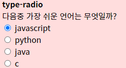

## 21.10.20

#### html

##### form - input

- 옵션
  - `placeholder=""` : 입력하기전 보여지는 글
  - `maxlenth=""` : 최대 글자 갯수 
- `type="hidden"` : 아예 보이지 않게 숨기는 기능

- `type="radio"`
  - 
  - 같은 질문에서 항목들은 name이 같아야함
  - value의 값을 적어줘야 함
  - `checked` : 처음 체크되게 하는 설정
- `type="checkbox"`
  - 같은 질문에 항목들은 name이 같아야함
  - value의 값을 적어줘야 함
  - `checked` : 처음 체크되게 하는 설정

