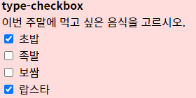

## 21.10.20

#### html

##### form - input

- 옵션
  - `placeholder=""` : 입력하기전 보여지는 글
  - `maxlenth=""` : 최대 글자 갯수 
  - `size=""` : 들어갈 글자 갯수 -> css에서 조절 가능함 굳이 html에서 표현 안해도 됨
- `type="hidden"` : 아예 보이지 않게 숨기는 기능

- `type="radio"`

  - 
  - 같은 질문에서 항목들은 name이 같아야함
  - value의 값을 적어줘야 함
  - `checked` : 처음 체크되게 하는 옵션
  - `multiple` : 라디오박스에서 여러개 선택할 수 있는 옵션

- `type="checkbox"`

  - 
  - 같은 질문에 항목들은 name이 같아야함
  - value의 값을 적어줘야 함
  - `checked` : 처음 체크되게 하는 설정

- 버튼 (file제외하고는 label사용 X)

  - 1. 버튼에서 내용상 구분이 되어야 하는 항목에서는 시각 형태로도 구분이 되게 처리

    2. 제출/전송/동의 항목이 존재할 경우, 그에 반하는 버튼도 만들면서 **취소를 우선순위**로 두어야 한다.

  - `type="submit"`

    - 전송
    - `value=""` : value 있어야함

  - `type="reset"`

    - 취소
    - `value=""` : value 있어야함

  - `type="image"`

    - submit과 같은 기능이지만 버튼 -> 이미지 
    - value처럼 `alt`가 있어야 함

  - `type="button"` : 

  - `type="file"` : 파일 첨부

    - `name=""` , `value=""` 필요

- `<textarea> </textarea>` 
  - `cols=""` : 가로로 들어갈 수 있는 갯수
  - `rows=""` : 세로로 들어갈 수 있는 갯수
  - `readonly` : 코드에서 적어놓은 글을 페이지에서 수정 불가
  - css `resize: none;` : 사이즈 조절 불가능 옵션
- `<select> </select>` 
  - 선택하는 태그
  - css로 따로 디자인 불가능

