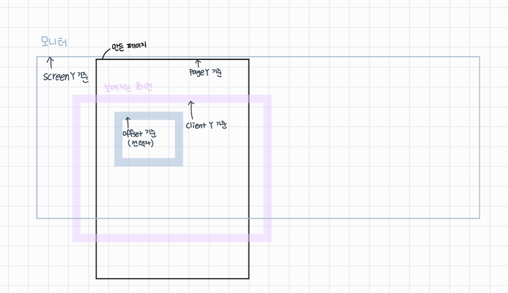

## 21.12.21

#### js

#### addEventListener

- `mouseenter`
  
  - 단순히 해당 영역 마우스가 올라감
  
  - <-> `mouseleave` : 마우스가 벗어남

- `mouseover`
  
  - 안에 버튼 같은게 있을 경우 중첩으로 올라감
  
  - <-> `mouseout` : 마우스가 벗어남

- 좌표 찾기
  
  - `clientX`, `clientY` : 브라우저에 보이는 기준 좌표 (스크롤과 관계없이 무조건 보이는 기준)
  
  - ~~`layerX`, `layerY` : 비표준 / 브라우저 기준~~
  
  - `movementX`, `movementY` : 이전 기준과 차후 기준의 값 찾이
  
  - `offsetX`, `offsetY` : this 기준 (이벤트 주체/객체)
  
  - `pageX`, `pageY` : 브라우저 페이지 기준 (스크롤 옮겨져도 실제 전체 기준)
  
  - `screenX`, `screenY` : 모니터 전체 기준 좌표
  
  

#### 

#### 기타

- `window.requestAnimationFrame(callback)`
