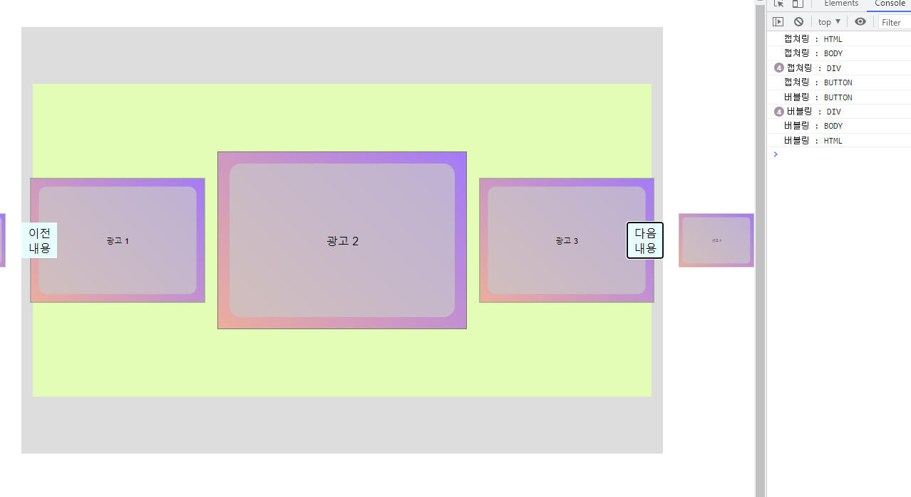

## 21.12.23

[사용 문서(e_05_slide_movie.html)]: ../study_code/b_step_03/html/e_05_slide_movie.html


#### javascript

#### 이벤트 위임

- 실제로 클릭해야하는 요소가 아닌 그 부모에서 클릭했을 경우 해당하는 요소가 반응할 수 있도록 인식되는 형태
  
  - `slide_btn` > `button`2개가 있을경우 새로 버튼이 1개 더 추가 되었을때 button은 더이상 인식  X / 인식하기 위해서는 해당 버튼 selector을 생성 후에 추가 해줘야함
  
  - `slide_btn`을 이벤트처리를 하면 이벤트 위임 현상으로 새로운 버튼도 인식이 가능
  
  

- ##### 버블링/캡처링
  
  - ✍ 내 정리 : 버블링과 캡처링은 이벤트 리스너를 `div`나 `ul`같은 요소에 넣었을 때 알아서 판단해서 처리 해줌
  
  - ✍ `addEventListener` 에 `false` : 버블링 / `true` : 캡쳐링 - 안썼을때 `false`가 기본
  
  - **버블링** : 부모에 전달 - ✍ (부모에게 내 기능을 위임)
  
  - 버블링현상 정리
  
    ```js
    elBtn.addEventListener('click', (e)=>{
      e.preventDefault();
      console.log('버튼의 부모에서 명령');
    });
    
    elNext.addEventListener('click', function(e){
      e.preventDefault();
      e.stopPropagation(); // 버블링현상 막기 
        // 이 기능이 없으면 버튼(elNext)을 클릭했는데 부모(elBtn)도 클릭이됨
      console.log('버튼에서 명령');
    });
    ```
  
    
  
  - **캡처링** : 자식에게 전달
  
  - 버블링 + 캡쳐링 구분
  
    ```js
    for(let elem of document.querySelectorAll('*')) {
      elem.addEventListener('click', e=> console.log(`캡쳐링 : ${elem.tagName}`), true);
      elem.addEventListener('click', e=> console.log(`버블링 : ${elem.tagName}`));
    }
    ```
  
  - 결과 - 다음내용 클릭함
  
    


#### 기타

- 함수별  `this`가 달라지는 이유

```js
let elBtn = elViewBox.querySelector('.slide_btn');
elBtn.addEventListener('click', (e)=>{
  // function(){} 함수일 경우 이벤트 주체, ()=>{} 함수에서는 전체문맥
  // 화살표함수 : 생성자함수를 만들 수 없는 함수이기에 this를 사용하면 무조건  window를 가르킴
  console.log( this );           // Window
    // 화살표함수와 일반함수에 따라 역할이 달라진다.
  
  console.log(e.currentTarget);  // <div class="slide_btn">…</div>
    // 이벤트를 동작시키는 요소
    
  console.log(e.target);         // <button type="button" class="next">다음내용</button>
    // 이벤트가 발생되는 요소
})
```


- `e.target.classList.contains(name)` -> 이벤트 발생시킨.그것.class이름.있나요?(name) : 클래스명 포함 유무

